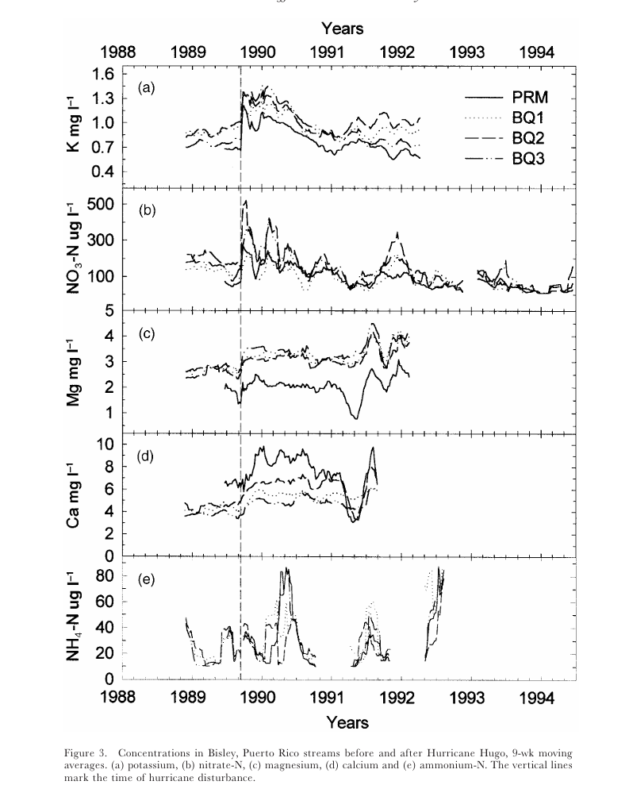

# EDS214 Final Project - Figure 3 Recreation 
##  Kate Frankland 

## Background 
- For the EDS 214 final project, we are going to be recreating figure 3 from the Schaefer et. al (2000) paper (https://doi.org/10.1017/s0266467400001358). This figure displays the change of concentrations for five different ions, being K (Potassium), Mg (Magnesium), Ca (Calcium), nitrate (NO3-N), and ammonium (NH4-N). Analyzing these ions can help understand the impact that hurricanes have on watersheds and nutrient cycling. 




## Data 
- To recreate this figure, the data for the four sites being analyzed needs to be imported and cleaned. This has been completed in clean_data.R, where the years were filtered to only include rows between 1988 and 1994. Columns with only including "Sample_Date", "K", "NO3-N", "Mg", "Ca", and "NH4-N" have also been created. In the cleaned data folder, the moving_average function ("R/moving-average.R") was also applied to each site, and each site has been respectively renamed to "BQ1", "BQ2", "BQ3", and "PR".

``` {r}
library(tidyverse)
fig3_data <- read_csv("../outputs/fig3_data.csv")
```

## Methods 
For this project, a moving_average() function was created to calculate the mean concentration of each ion within 9-week windows. Each 9-week window should be sequential and not overlap with one another. This mutate function was added to "clean_data.R" to find the moving average for each site. 

## Using pivot_longer to prepare for our ggplot
The pivot_longer() function will be used to convert our data to a longer format, allowing for columns to be created for each ion, and a column to be created to display eaach concentration. 


```{r}
fig3data_long <- fig3_data |> 
  pivot_longer(cols = c(k_mgl, mg_mgl, ca_mgl, no3n_mgl, nh4n_mgl),
  names_to = "Ions", 
  values_to = "Concentrations",
)
```

## Results and figure recreation 

The figure created shows the 9-week average ion concentrations at the four watershed sites between the years 1988 to 1994, similar to the original. Differerent y-axis scales are used because ions have different concentration ranges 


```{r}
fig3data_long |> 
  rename(Years = window_start) |> 
  ggplot(mapping = aes(
    x = Years,
    y = Concentrations,
    colour = site,
    group = site,
    linetype = site
)) +
  theme_bw() +
  geom_line(color = "black") +
  facet_wrap(~Ions, scales = "free", ncol = 1)
```

